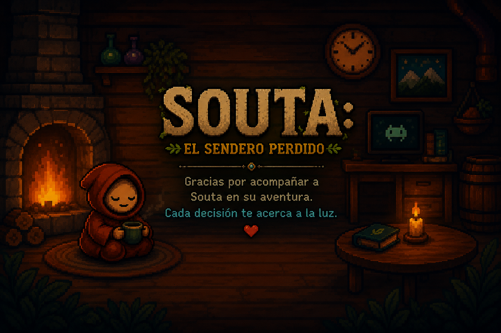

# 🌲 Souta: El Sendero Perdido

### 🌌 A journey through fear, mystery and forgotten memories 🌌

✨ Atmospheric 2D Horror Adventure made with Unity ✨

---

# 🎮 About The Game

╔══════════════════════════════╗  
🌲 𝑺𝒐𝒖𝒕𝒂: 𝑬𝒍 𝑺𝒆𝒏𝒅𝒆𝒓𝒐 𝑷𝒆𝒓𝒅𝒊𝒅𝒐 🌲  
╚══════════════════════════════╝  

🌑 ✦ 🌲 ✦ 👁️ ✦ 🌲 ✦ 🌑

**Souta: El Sendero Perdido** is a 2D horror-adventure experience created with Unity, where mystery, fear, and survival merge into a haunting journey through an abandoned forest lost in darkness.

The player must guide Souta across dangerous paths filled with hostile creatures, hidden secrets, and strange challenges while searching for the legendary cabin hidden deep within the woods.

But the forest is alive.

And it remembers every step.

✨ *“Some paths are not meant to be found.”* ✨

---

# 🌲 Gameplay Features

╭━━━━━━━━━━━━━━━━━━━━━━━━━━━━━━━━━━━━━━╮  
⚔️ Survival • 👾 Horror • 🧠 Knowledge  
╰━━━━━━━━━━━━━━━━━━━━━━━━━━━━━━━━━━━━━━╯

---

## ⚔️ Dynamic Combat System

The darkness is never empty.

Hostile creatures roam endlessly through the forest, waiting silently between the shadows.  
Fight enemies using close-range combat mechanics while avoiding dangerous attacks and surviving increasingly tense encounters.

👾 ────── ❖ ────── 👾

*"Fear appears when the silence suddenly disappears."*

---

## ❤️ Survival Mechanics

Every decision matters.

Health is limited, danger is constant, and survival depends on how well the player manages resources while exploring the unknown.

Collect healing potions, avoid enemy attacks, and continue moving forward before hope disappears completely.

❤️ ✦ ☠️ ✦ ❤️

*"The forest does not forgive mistakes."*

---

## 👾 Intelligent Enemy AI

You are never truly alone.

Enemies patrol abandoned areas and begin chasing the player once detected, creating moments of tension, panic, and uncertainty.

The deeper the player travels into the forest, the more oppressive and dangerous the environment becomes.

🌲 👁️ 🌲 👁️ 🌲

*"Something is always watching from the darkness."*

---

## 🧠 Educational Survival Challenges

Unlike traditional horror games, Souta transforms learning into part of the gameplay experience.

During the adventure, mysterious **Yes / No survival questions** will appear related to:

🌿 Nature  
🧬 Biology  
🏕️ Survival Knowledge  

Correct answers reward the player with healing and advantages.  
Wrong answers increase danger and bring Souta closer to defeat.

🧠 ✨ 🌿 ✨ 🧠

*"In this forest... knowledge can save your life."*

---

## 🌌 Atmospheric Pixel Art World

Explore a mysterious pixel-art world inspired by retro horror adventures.

Foggy forests, glowing lights, abandoned paths, and eerie silence create an immersive atmosphere full of loneliness, tension, and hidden stories.

Every area was designed to make the player feel lost inside a world consumed by darkness.

🌙 ───── ✦ ───── 🌙

*"Not every light leads you home."*

---

# 🛠️ Developed With

Unity 2D • C# • Visual Studio Code • GitHub

---

# 🏠 Final Destination

✨ After surviving the darkness of the forest, Souta finally reaches the warmth of the cabin. ✨

<i>
“Sometimes the most difficult journeys are the ones that finally lead us home.”
</i>

---

# 🚧 Development Status

🌲 Expanding the game world  
👾 Adding more enemies and mechanics  
📱 Planned for PC & Mobile  
✨ Improving atmosphere and storytelling  

---

# 👩‍💻 Developer

Created with 💗 by **Alejandra Trujillo**

🎨 UX/UI Designer  
💻 Systems Engineering Student  
🌸 Indie Game Developer  

---

# ⚠️ Assets & Credits

Some sprites, decorations, and visual resources used in this project  
were obtained from talented creators on itch.io  
and are used for educational and non-commercial purposes.

---

# 🌸 Final Words

🌲✨ Thanks for entering the forest... ✨🌲

<i>
“Not every lost path is meant to destroy you...  
some exist to help you discover who you truly are.”
</i>

