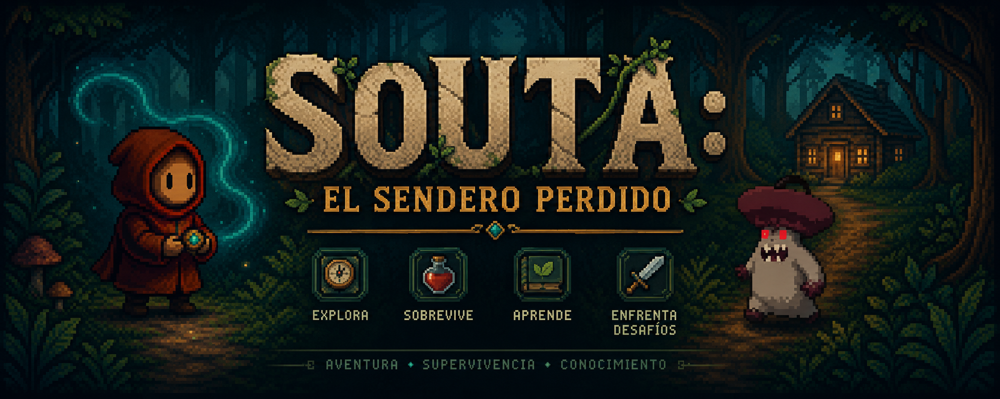

# 🌲 Souta: El Sendero Perdido

  

✨ A 2D Horror Adventure Game made with Unity ✨

---

## 🎮 About The Game

**Souta: El Sendero Perdido** is a 2D adventure and survival game developed in Unity.  
The player must explore a mysterious forest filled with dangers, enemies, and hidden challenges while trying to reach the final cabin and survive.

---

## 🌲 Main Features

- 🧍 2D Character Movement & Jump System  
- ⚔️ Combat System against enemies  
- ❤️ Health & Potion System  
- 👾 Enemy AI with chase mechanics  
- 🌿 Exploration in a dark forest environment  
- 🧠 Educational survival questions system  
- 🏠 Final Cabin Victory System  
- ☠️ Game Over System  
- 🎨 Pixel Art aesthetic  

---

## 🧠 Educational System

The game includes interactive **Yes / No questions** related to:

- Biology  
- Nature  
- Survival  

Correct answers reward the player with healing, while wrong answers reduce health, making the gameplay more challenging and interactive.

---

## 🛠️ Built With

---

## 📸 Screenshots

  

---

## 🚀 Game Status

🔨 Currently in development  
📱 Planned for PC & Mobile  
🎮 Developed with Unity 2D  

---

## 👩‍💻 Developer

Made with 💗 by **Alejandra Trujillo**

GitHub:
👉 https://github.com/alejandra-dev-creator

---

## ⚠️ Assets Credits

Some visual assets, sprites, and backgrounds used in this project were obtained from creators on itch.io for educational and non-commercial purposes.

---

## 🌸 Thanks for visiting this project

  

